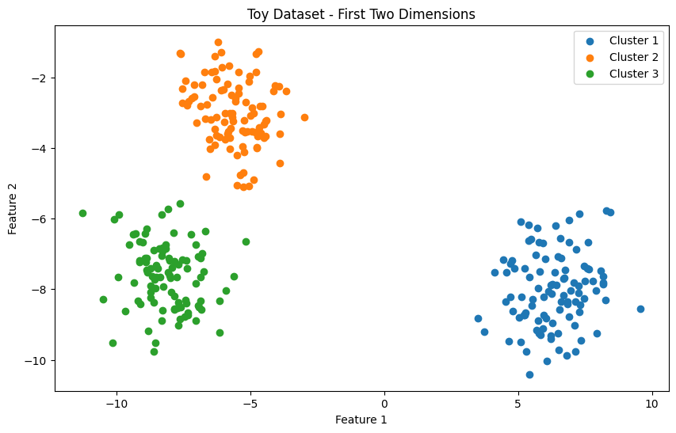
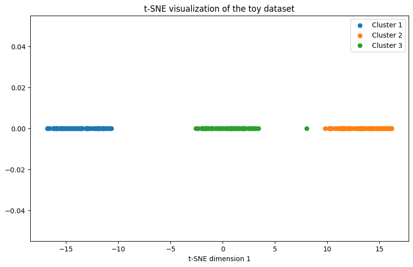

# t-SNE

Implementation of t-distributed stochastic neighbor embedding (t-SNE) in Python from scratch based on the original paper https://www.jmlr.org/papers/volume9/vandermaaten08a/vandermaaten08a.pdf.

T-SNE is powerful statistical method for visualizing data points in high dimension by projecting them into a lower dimension. It can reveal clusters and patterns in data that may not be apparent using linear dimensionality reduction techniques like PCA.

Demo notebook shows how t-SNE preserves cluster-like structures when projecting data points from 2d to 1d

